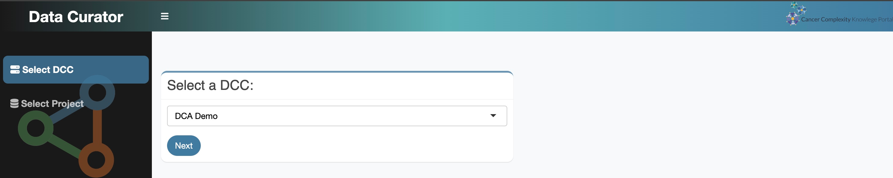
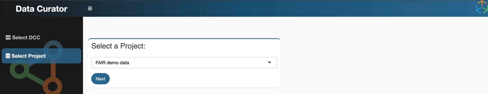
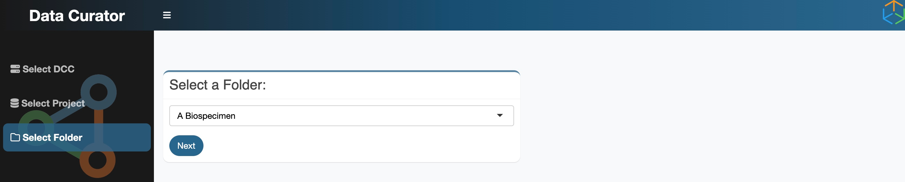
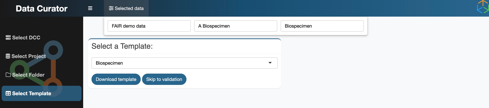
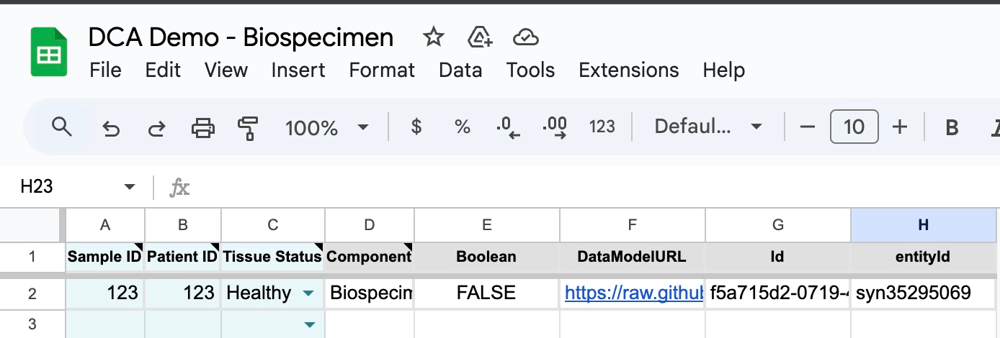
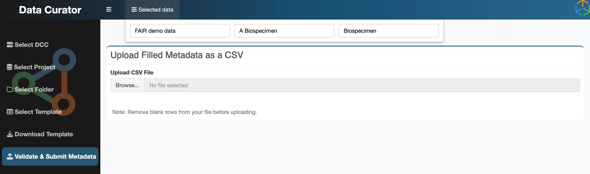

# How to Use Multiple Templates

This tutorial will guide you through using the templates provided in the Data Models section with the **Data Curator App (DCA)** to organize and submit your data. The Data Curator App simplifies data formatting and ensures that submissions meet metadata standards.  

Access the Data Curator App here: [Data Curator App](https://dca.app.sagebionetworks.org/)

## **Step 1: Select a Data Coordination Center (DCC)**  
After launching the app, choose the relevant DCC from the dropdown menu. For example, select **DCA Demo**.

## **Step 2: Choose a Project**
Select the project you want to work with, such as **FAIR Demo Data**.

## **Step 3: Select a Folder**
Choose the appropriate folder for your data. For example, select **A Biospecimen**.

## **Step 4: Select a Template**
Choose a template that matches the type of data you're working with. The templates available in this app align with the templates provided in the Data Models section of this documentation. Download the selected template to your computer.

This will open a CSV file in a Google Sheet on your computer. You can save this to your device and use the template to add your metadata to it.

## **Step 5: Populate the Template with Your Data**
Open the downloaded CSV template and fill in your data. Use the descriptions and examples provided in the Data Models section to guide you. Below is an example of a completed **Dataset** template:

| **Dataset Name**                         | **Dataset Alias** | **Dataset Description**                                                                                                                                                           | **Dataset Url**                                                                         | **Dataset Assay** | **Dataset Species** | **Dataset Tumor Type** | **Dataset Tissue** | **Dataset File Formats** | **Dataset Grant Number** | **Dataset Pubmed Id** | **Dataset View** | **DatasetView_id**       |
|-------------------------------------------|-------------------|-----------------------------------------------------------------------------------------------------------------------------------------------------------------------------------|------------------------------------------------------------------------------------------|------------------|---------------------|-------------------------|-------------------|---------------------------|--------------------------|------------------------|-----------------|---------------------------|
| RNA Sequencing of Lung Cancer Samples 2021 | GSE56789          | This dataset contains RNA sequencing data from 200 lung cancer samples... | [https://www.ncbi.nlm.nih.gov/geo/query/acc.cgi?acc=GSE56789](https://www.ncbi.nlm.nih.gov/geo/query/acc.cgi?acc=GSE56789) | RNA Sequencing   | Homo sapiens         | Glioblastoma            | Lung              | CSV, PDF                  | CA209971                 | Not applicable         | Table           | DatasetView_12345         |

!!!important  
    Please note that to successfully upload this template, you will need to input the following for steps 1-4:
      
      1. DCC = Cancer Complexity Knowledge Portal - Database
      2. *Your Project name*
      3. *Your folder name*
      4. (optional) Skip to validation

## **Step 6: Upload and Validate Metadata**
Upload the completed CSV template back into the Data Curator App and proceed to validate your metadata. The app will check for errors and inconsistencies.

## **Benefits of Using the Data Curator App**
- **Ease of Use:** Templates are pre-structured, making it easy to input your data correctly.
- **Metadata Consistency:** The app validates your data to ensure compliance with predefined models and metadata standards.
- **Efficient Submission:** By using the templates and app, you reduce the risk of errors during submission to data portals like the [**Cancer Complexity Knowledge Portal**](https://www.cancercomplexity.synapse.org/).

## **Next Steps**

Now that you've learned how to use the Data Curator App with templates, explore other data models to match the specific type of data you're working with. Each template is designed to help you organize and submit structured metadata for various research elements.

| **Data Model**            | **When to Use This Template**                                 | **Link**                                |
|---------------------------|---------------------------------------------------------------|------------------------------------------|
| Dataset Data Model        | Use this to describe and organize datasets, including key details like study purpose, data type, and access links. | [Dataset Data Model](../model/dataset.md) |
| Dataset Sharing Plan      | Use this to define your plan for sharing datasets, including permissions, licensing, and compliance with policies. | [Dataset Sharing Plan](../model/DataDSP.md) |
| Education Resource Model  | Use this for metadata related to learning materials, training datasets, or educational tools shared with your research. | [Education Resource Data Model](../model/education.md) |
| File Data Model           | Use this to catalog individual files within a dataset, including file format, processing level, and storage location. | [File Data Model](../model/file.md)      |
| Grant Data Model          | Use this to document funding sources and grants that support the research, including grant IDs and sponsors. | [Grant Data Model](../model/grant.md)    |
| Person Data Model         | Use this to capture details about individuals involved in the project, such as researchers, collaborators, or data submitters. | [Person Data Model](../model/person.md)  |
| Publication Data Model    | Use this to track publications related to the research, including journal articles, white papers, or reports. | [Publication Data Model](../model/publication.md) |
| Study Data Model          | Use this to provide an overview of a research study, including objectives, design, and related datasets. | [Study Data Model](../model/study.md)    |
| Tool Data Model           | Use this to describe tools, software, or resources used for data collection, analysis, or visualization. | [Tool Data Model](../model/tool.md)      |

Explore these links to find the right template for your data and continue with your submissions.

