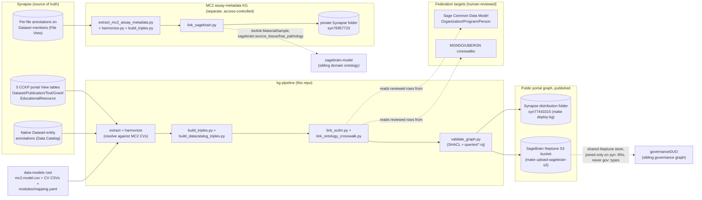
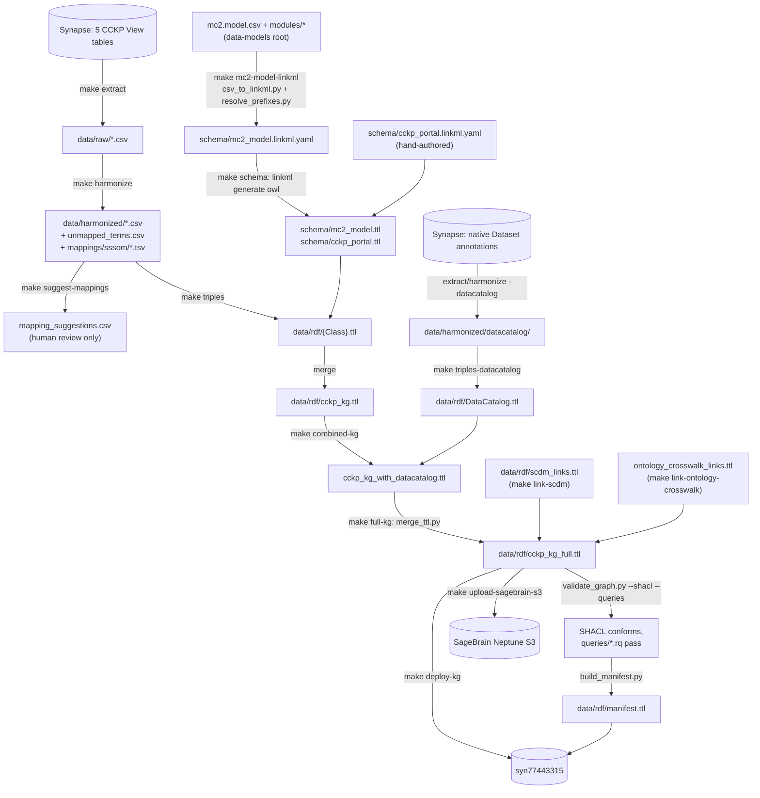

# CCKP knowledge graph design

This page is the guide to `kg-pipeline/`, the knowledge-graph pipeline that
sits alongside this repo's CSV data model: what it builds, how its layers
fit together, how it's built and validated, and how it relates to the
sibling ontologies it federates with. The model pages elsewhere on this site
document the CSV/LinkML data model itself (attributes, valid values,
templates); this page documents the RDF graph built from that model plus
live Cancer Complexity Knowledge Portal (CCKP) data. See
[`kg-pipeline/README.md`](https://github.com/mc2-center/data-models/blob/main/kg-pipeline/README.md)
for the full command reference and directory layout, and
[`plans/kg_pipeline_architecture_decisions.md`](https://github.com/mc2-center/data-models/blob/main/plans/kg_pipeline_architecture_decisions.md)
for the design rationale and decision history this page doesn't retell.

## 1. What the graph is for

The CCKP (cancercomplexity.synapse.org) already lists Datasets,
Publications, Tools, Grants and Educational Resources as rows in five
Synapse tables, each described by the MC2 data model's own controlled
vocabularies. That's enough for the portal's search UI, but not enough to
answer a graph-shaped question — "which tools were used on datasets tagged
with this MONDO disease term," "what did this consortium's funding
produce," "which publications cite this dataset" — without either a
federated SQL join across five tables or a hand-written script per
question.

`kg-pipeline/` turns the CCKP portal (plus this repo's own controlled
vocabularies) into an RDF knowledge graph: one LinkML schema for the
portal's five tables, real ontology-IRI mappings resolved from this
repo's CV CSVs (NCIT, MONDO, EFO, OBI, ROR, SPDX, ...), and an
extract → harmonize → map-to-RDF → validate pipeline modeled on
[nf-osi/kg-pipeline](https://github.com/nf-osi/kg-pipeline)'s stage
structure and never-silently-drop-a-value discipline, built on LinkML +
rdflib instead of a hand-authored OWL ontology + RML/Java. The result is
one graph, `data/rdf/cckp_kg_full.ttl`, queryable with plain SPARQL, and
published both to Synapse and to Sage Bionetworks' shared SageBrain
Neptune graph store.

What it deliberately does **not** do:

1. It doesn't resolve every value to an external identity. A CV value with
   no real ontology term is left as a plain literal (or, if a human has
   actively checked and confirmed no term exists, minted as an addressable
   but explicitly `cckp:provisional true` placeholder) — never guessed.
2. It doesn't auto-apply a candidate mapping. `make suggest-mappings` and
   `make crosswalk-ontology`/`make crosswalk-scdm` only ever propose;
   every crosswalk file ships a `reviewed` column a human must flip before
   its rows are consumed into an edge.
3. It doesn't assert governanceDUO's own `gov:SynapseEntity` type, even
   though this graph and governanceDUO's governance graph land in the same
   SageBrain Neptune store — see section 8.
4. It doesn't include Person/PersonView. The CCKP portal's own person data
   has an unconfirmed table id and a consent/display gate that would need
   separate handling — a documented v1 scope limit, not an oversight.
5. It doesn't reason over its own schema-level ontology mappings. Class
   alignment to schema.org/Biolink is declared in LinkML as
   `exact_mappings`/`close_mappings` (open-world, monotonic claims); where
   that matters for a consumer today (Biolink typing), `build_triples.py`
   materializes it as a real second `rdf:type` rather than waiting on a
   triple store to support OWL/RDFS entailment.
6. It doesn't merge the access-controlled MC2 assay-metadata layer
   (biospecimen/individual/model/sequencing/imaging) into the public
   graph. That's a separate pipeline stage, gitignored, published only to
   a private Synapse staging location — see sections 3 and 6.

## 2. Where it sits



- **Synapse** holds the source data: the 5 CCKP View tables
  (`kg-pipeline/data_sources.yaml` records each table's synId and last-pulled
  row count), native annotations on the Dataset entities behind those rows
  (the Data Catalog layer), and per-file annotations on the files inside a
  Dataset entity (the access-controlled `File View` layer).
- **data-models root** supplies the schema and its controlled vocabularies —
  `mc2.model.csv`, the CV CSVs under `modules/`, and `modules/mapping.yaml`,
  which maps each MC2 attribute to the CV file that backs it. kg-pipeline
  reads these directly; it doesn't duplicate the model.
- **kg-pipeline** (this repo, `kg-pipeline/`) runs the extract → harmonize →
  map-to-RDF → validate stages described in section 6, plus the optional
  DataCatalog/SCDM/ontology-crosswalk stages described in section 3.
- **Publish targets**: the public portal graph goes to a Synapse
  distribution folder (other systems pull `cckp_kg_full.ttl` + `manifest.ttl`
  straight from there) and, separately, to the shared SageBrain Neptune S3
  bucket, using the same PROV/VOID manifest convention
  [nf-osi/kg-pipeline](https://github.com/nf-osi/kg-pipeline) uses so either
  pipeline's build can trigger the same downstream Neptune auto-loader.
- **Federation targets**: the Sage Common Data Model (a sibling LinkML
  schema for cross-portal Organization/Program/Person entities) and
  MONDO/UBERON crosswalks for sagebrain-anchored disease/tissue terms — both
  human-reviewed before any edge is minted (section 6).
- **The MC2 assay-metadata KG** is a second, separate pipeline stage over
  access-controlled per-file annotations, publishing only to a private
  Synapse staging folder and linking into sagebrain-model's own classes —
  never merged with the public graph above (section 3).
- **governanceDUO** is a sibling repository's *access-control* governance
  graph, not part of this pipeline at all. It lands in the same SageBrain
  Neptune store as this graph, but the two are joined only by reusing the
  same canonical `https://www.synapse.org/Synapse:synNNN` IRI — never by a
  shared `rdf:type` (section 8).

## 3. The layers

| Layer | Answers | Built by | Output |
|---|---|---|---|
| **Schema (TBox)** | What classes/slots/enums exist; the ontology IRI behind every curated CV term | `make schema` (`linkml generate owl` over `schema/mc2_model.linkml.yaml` + `schema/cckp_portal.linkml.yaml`) | `schema/mc2_model.ttl`, `schema/cckp_portal.ttl` |
| **Portal instances** | One node per Dataset/Publication/Tool/Grant/EducationalResource row, typed `cckp:{Class}` | `make triples` (`scripts/build_triples.py`) | `data/rdf/{Class}.ttl`, merged into `data/rdf/cckp_kg.ttl` |
| **Ontology-IRI harmonization** | Which real ontology term a raw CV-backed portal value resolves to | `make harmonize` (`scripts/harmonize.py`), materialized as `cckp:{field}Term` edges by `build_triples.py` | `data/harmonized/*_harmonized.csv`, `mappings/sssom/*.sssom.tsv` |
| **Biolink dual typing** | The same instance queryable by its Biolink class without OWL reasoning | `build_triples.py`'s `BIOLINK_TYPE` map, in the same `make triples` pass | a second `rdf:type` triple per instance |
| **DataCatalog** | Native Synapse Dataset-entity annotations (`license`, `measurementTechnique`, `accessType`, ...) as `schema:` predicates on the same `cckp:Dataset` subject | `make triples-datacatalog` + `make combined-kg`/`make merge-datacatalog` | `data/rdf/DataCatalog.ttl`, folded into `cckp_kg_with_datacatalog.ttl` |
| **SCDM federation** | Institution/consortium/investigator links to cross-portal `sagecdm:Organization`/`Program`/`Person` | `make link-scdm` (`scripts/link_scdm.py`) | `data/rdf/scdm_links.ttl`, folded into `make full-kg` |
| **Ontology-crosswalk federation** | The same tumor-type/tissue concept, also anchored in MONDO/UBERON, for federated queries against a sagebrain-anchored graph | `make link-ontology-crosswalk` (`scripts/link_ontology_crosswalk.py`), gated on human-reviewed crosswalk rows | `data/rdf/ontology_crosswalk_links.ttl`, folded into `make full-kg` |
| **MC2 assay-metadata KG** (access-controlled) | Biospecimen/Individual/Model-level facts about the files inside a Dataset, linked into sagebrain-model's own classes | separate `make extract-mc2-assay`/`triples-mc2-assay`/`link-sagebrain` targets, never part of `make all` | `data/mc2_assay/rdf/mc2_assay_kg.ttl`, `sagebrain_links.ttl` — gitignored, private Synapse staging only |
| **Manifest** | What commit/build produced a given graph, and where it was published | `make manifest` (`scripts/build_manifest.py`), folded into `make full-kg` | `data/rdf/manifest.ttl` |

Several of these are separate files on purpose, not a missed merge step:
`data/rdf/` is deliberately several files, not one, because they're
different trust tiers. `cckp_kg.ttl` (the base 5-class graph) is the
pipeline's own primary harmonization anchor; `DataCatalog.ttl` is the same
subjects annotated from a different upstream source, not yet broadly
verified; `scdm_links.ttl` is this pipeline's own derived, provisional read
of SCDM, not an authoritative SCDM data source; `ontology_crosswalk_links.ttl`
is gated on a human `reviewed=true` flip per row. `combined-kg`/`full-kg`
rebuild their inputs fresh and merge them into their own separate output
file rather than mutating `cckp_kg.ttl` in place, so loading "everything"
is one target instead of a manual union — see "Consuming the graph" in the
README for the full file-by-file picture.

## 4. The model

### LinkML schemas

- **`schema/mc2_model.linkml.yaml`** — generated from this repo's own
  `mc2.model.csv` + `modules/mapping.yaml` via a vendored, dependency-free
  copy of the `csv-to-linkml` converter (`scripts/vendor/csv_to_linkml.py`,
  `make mc2-model-linkml`), then patched by `scripts/resolve_prefixes.py`
  to add ontology-base prefixes derived from the CVs' own `Ontology Url`
  data (see `schema/mc2_model_prefixes_report.md`). `id:
  https://w3id.org/mc2-center/mc2-model`. Not regenerated by `make
  schema`/`make all` — only run when `modules/` changes upstream, and the
  regenerated file is committed like any other generated-but-checked-in
  artifact.
- **`schema/cckp_portal.linkml.yaml`** — hand-authored, `imports:
  mc2_model.linkml` for its shared controlled-vocabulary enums. Its 5
  classes (Dataset, Publication, Tool, Grant, EducationalResource) describe
  the *live* Synapse column shapes of the 5 CCKP View tables — cardinality
  (scalar vs. list) was verified against
  `synapseclient.Synapse.getTableColumns`, not assumed from the MC2 model or
  from how a field name reads (several fields surprise in both directions;
  see the file's own header comment).

### Class alignment (schema.org / Biolink)

`cckp_portal.linkml.yaml` declares a class-level `exact_mappings`/
`close_mappings` per class: `Dataset` → `schema:Dataset` and
`biolink:Dataset` (both exact); `Publication` → `schema:ScholarlyArticle`
(schema.org has no bare "Publication" class — this is what the Bioschemas
`Publication` profile itself is built on) and `biolink:Publication` (both
exact); `Tool` → `schema:SoftwareApplication` (exact) and
`biolink:InformationContentEntity` (close — Biolink has no dedicated Tool
class); `Grant` → `schema:MonetaryGrant` (exact) and
`biolink:AdministrativeEntity` (close); `EducationalResource` →
`schema:LearningResource` and `biolink:InformationContentEntity` (both
close). These are schema-level, open-world claims in the LinkML source.
`build_triples.py`'s `BIOLINK_TYPE` map additionally *materializes* the
Biolink half as a real second `rdf:type` on every instance, so a consumer
that only speaks Biolink doesn't need OWL/RDFS reasoning to use it —
`queries/biolink_dual_typing_is_consistent.rq` checks this holds on every
build. The schema.org half is asserted only at the schema level, not
similarly materialized per instance (the DataCatalog layer separately
asserts real `schema:` *predicates*, e.g. `schema:measurementTechnique`, on
the same subjects).

### Foreign keys: "Key" in the model, "Ref" in the graph

The MC2 data model's own convention (documented for the CSV/LinkML layer,
not specific to kg-pipeline) names every foreign-key attribute
`"<Entity> Key"`, derived from `"<Entity>_id"` — `Dataset Key`,
`Biospecimen Key`, `GrantView Key`, and so on — defined once in
`modules/shared/annotationProperty.csv` and reused via `DependsOn` by every
module that needs it. That convention governs the *model*: a join is a
plain string value naming another record's own identifying field, not an
embedded object.

The graph's own predicate naming is a separate thing, layered on top only
where kg-pipeline has actually resolved a join. `cckp_portal.linkml.yaml`
doesn't reuse the model's "Key" vocabulary directly (the 5 View tables have
their own join columns — `grantNumber`, `pubMedId`, `datasetAlias`,
`consortium`, ...); instead it marks which string-valued slots are a join
with a `cckp_join: "TargetClass.target_field"` annotation (e.g.
`Publication.datasetAlias`'s `cckp_join: "Dataset.datasetAlias"`), and
`build_triples.py` resolves those at Stage 4 into a real object-property
edge, `cckp:{field}Ref` (`cckp:datasetRef`, `cckp:grantNumberRef`,
`cckp:pubMedIdRef`, ...) pointing at the target row's own minted IRI —
alongside, not instead of, the original literal value.

`mc2_model.linkml.yaml` itself carries no `cckp_join` annotations at all
(confirmed: the string doesn't appear anywhere in that generated file), so
a "Key"-named field reached through it — e.g. `File View`'s `Biospecimen
Key`, used by the separate MC2 assay-metadata KG stage — comes through
`build_triples.py` as a plain string literal (`cckp:biospecimenKey`), not a
resolved edge. `scripts/link_sagebrain.py` resolves that one specifically,
by grouping `File View` rows on the literal `Biospecimen Key` value and
minting one `biolink:MaterialSample` stub node per distinct key (section 3).
In short: "Key" is the model's naming convention for a foreign-key
*attribute*; "Ref" is this pipeline's own suffix for an RDF *edge* it has
actually resolved — not every "Key" field currently has a matching "Ref"
edge, and that gap is explicit in the code rather than silently assumed
away.

### A worked example

Real output, trimmed, from a live build
(`kg-pipeline/data/rdf/Dataset.ttl`, `make triples` against the current
CCKP portal data) — one Dataset row, `syn20826574`:

```turtle
@prefix cckp: <https://w3id.org/mc2-center/cckp-portal/> .
@prefix biolink: <https://w3id.org/biolink/vocab/> .

<https://www.synapse.org/Synapse:syn20826574> a biolink:Dataset,
        cckp:Dataset ;
    cckp:assay "CRISPR" ;
    cckp:consortium "CSBC" ;
    cckp:datasetAlias "Genetic Interactions of Chromatin-Related Genes" ;
    cckp:datasetId "syn20826574" ;
    cckp:datasetName "Genetic Interactions of Chromatin-Related Genes" ;
    cckp:doi "https://doi.org/10.1038/nmeth.4286" ;
    cckp:doiIri <https://doi.org/10.1038/nmeth.4286> ;
    cckp:fileFormats "Pending Annotation" ;
    cckp:fileFormatsTerm <http://purl.obolibrary.org/obo/NCIT_C53470> ;
    cckp:grantNumber "CA209891" ;
    cckp:grantNumberRef <https://www.synapse.org/Synapse:syn10140998> ;
    cckp:pubMedId "28481362" ;
    cckp:pubMedIdIri <https://pubmed.ncbi.nlm.nih.gov/28481362> ;
    cckp:pubMedIdRef <https://w3id.org/mc2-center/cckp-portal/data/Publication/28481362> ;
    cckp:species "Human" ;
    cckp:speciesTerm <http://purl.obolibrary.org/obo/NCIT_C14225> ;
    cckp:tumorType "Not Applicable" ;
    cckp:tumorTypeTerm <http://purl.obolibrary.org/obo/NCIT_C48660> ;
    cckp:version 1 .
```

Reading this one node top to bottom: the subject is the dataset's own
canonical Synapse IRI, not a second identifier (section 5); it's dual-typed
`biolink:Dataset`/`cckp:Dataset`; `cckp:doi`/`cckp:pubMedId` are the raw
portal values, and `cckp:doiIri`/`cckp:pubMedIdIri` are resolvable external
IRIs templated straight from their shape, no CV curation involved;
`cckp:fileFormatsTerm`/`speciesTerm`/`tumorTypeTerm` are the real NCIT
concept a harmonized CV-backed value resolved to (even the placeholder
"Pending Annotation" is itself a term in the file-format CV, with its own
ontology mapping, `NCIT:C53470`); and `cckp:grantNumberRef`/`pubMedIdRef` are the two resolved
joins — one landing on another Synapse-canonical subject (the funding
Grant), one on a locally-minted `w3id.org` subject (the Publication, keyed
by its PubMed ID, no Synapse entity of its own).

## 5. Identifiers and namespaces

Every instance IRI is minted by one function, `mint_iri()` in
`scripts/build_triples.py`, so every script that needs to point at an
existing row (`build_triples.py` itself, `link_scdm.py`, `link_sagebrain.py`)
mints or looks it up the same way:

1. `mint_id(cls_name, row)` picks the row's identifying string:
   `Dataset`/`Grant` use their declared LinkML `identifier` slot
   (`datasetId`/`grantId`, always populated); `Publication`/`Tool`/
   `EducationalResource` have no such slot (verified against the live table
   schema, not assumed), so each falls back through `FALLBACK_ID_FIELD`'s
   documented per-class field list, and finally to a synthetic id —
   `"synthetic-" + sha1(...)[:16]` — hashed from a last-resort field
   combination, only when nothing else is populated.
2. `mint_iri(cls_name, row_id)` checks whether that id already looks like a
   real Synapse entity id (`SYNAPSE_ID_RE`, `^syn\d+$`, case-insensitive). If
   so, the row gets the canonical Synapse IRI,
   `https://www.synapse.org/Synapse:synNNN...` — the identical base
   governanceDUO and sagebrain-model use for the same entities, so the
   graphs join on it with no translation. Otherwise it gets the placeholder
   `https://w3id.org/mc2-center/cckp-portal/data/{Class}/{id}` IRI this
   pipeline itself owns.

A CV value a human has actively checked against every relevant external
vocabulary and confirmed has no real term (`mappings/confirmed_unmappable.tsv`)
gets a third kind of IRI, `https://w3id.org/mc2-center/cckp-portal/terms/{field}/{slug}`,
flagged `cckp:provisional true` — an addressable, annotatable node rather
than a dead-end literal, but never confused with a resolved external
mapping.

| Namespace | Used for | Examples |
|---|---|---|
| `cckp:` = `https://w3id.org/mc2-center/cckp-portal/` | Every class/predicate this pipeline mints | `cckp:Dataset`, `cckp:tumorTypeTerm`, `cckp:datasetRef` |
| `https://w3id.org/mc2-center/cckp-portal/data/` (no short prefix bound in the Turtle output) | Locally-minted instance IRIs for a row with no Synapse-entity identity | `.../data/Publication/28481362` |
| `https://w3id.org/mc2-center/cckp-portal/terms/` | Tier-3 provisional placeholder concepts | `.../terms/tumorType/pan-cancer` |
| `https://www.synapse.org/Synapse:` | Canonical Synapse-entity IRIs — the same base governanceDUO/sagebrain-model use | `https://www.synapse.org/Synapse:syn20826574` |
| `mc2:` = `https://w3id.org/mc2-center/mc2-model/` | MC2 model schema terms | `mc2:TumorTypeEnum` |
| `biolink:` = `https://w3id.org/biolink/vocab/` | Dual-typing, `link_sagebrain.py`'s stub nodes | `biolink:Dataset`, `biolink:MaterialSample` |
| `schema:` = `https://schema.org/` | Class-level alignment + real DataCatalog predicates | `schema:Dataset`, `schema:measurementTechnique` |
| `sagecdm:` = `https://sage-bionetworks.github.io/SageCommonDataModel/` | SCDM federation nodes/edges | `sagecdm:Organization`, `sagecdm:Person` |
| `sagebrain:` = `https://w3id.org/synapse/sagebrain#` | MC2 assay-metadata KG's links into sagebrain-model | `sagebrain:source_tissue`, `sagebrain:has_pathology` |
| Real ontology bases (`http://purl.obolibrary.org/obo/{PREFIX}_`, plus `EDAM:`, `ROR:`, `SNOMED:`, ...) from `schema/mc2_model.linkml.yaml`'s `prefixes:` block | Real, resolved ontology/registry terms | `http://purl.obolibrary.org/obo/NCIT_C4872` |
| `shape:` = `https://w3id.org/mc2-center/cckp-portal/shapes#` | SHACL shape names | `shape:DatasetShape` |

kg-pipeline deliberately never mints or asserts anything in governanceDUO's
own `gov:` namespace — see section 8.

## 6. How the graph is built



### Harmonization and SSSOM

`make harmonize` (`scripts/harmonize.py`) resolves every `mc2_enum`-tagged
slot's raw portal value against the MC2 CV it maps to
(`modules/mapping.yaml`), including `Nonpreferred Terms` as aliases. Two
reports come out of every run: `unmapped_terms.csv` (a value that matched
nothing in its CV — passed through unresolved, never dropped) and
`malformed_cv_terms.csv` (a CV row's own `Ontology Identifier`/`Ontology
Url` isn't a valid CURIE/URL — treated as "no mapping," not a fake IRI).
Every value that *did* resolve is also written to a standard SSSOM file,
`mappings/sssom/{enum}.sssom.tsv` — a reviewable, portable byproduct of the
join against the CVs, not the primary curation artifact.

A coverage gate, not a fixed threshold: `make validate` compares each
field's unmapped-value count against a checked-in ratchet baseline
(`mappings/coverage_baseline.json`) and fails only if a field's count *grew*
— a brand-new CV with gaps isn't a day-one failure, but a tracked field
quietly getting worse is. `make update-coverage-baseline` moves the ratchet
forward after an intentional curation pass or an accepted new gap.

### Suggest-mappings and crosswalks (human review, never auto-applied)

`make suggest-mappings` (`scripts/suggest_mappings.py`) turns
`unmapped_terms.csv` into a reviewable worklist,
`mapping_suggestions.csv`, classifying each miss as a `curation_gap` (the
CV term exists but its own `Ontology Identifier` is blank), a
`possible_typo` (a close fuzzy match to a real CV term), or a `novel_term`
— querying whichever external registry fits that CV
(`choose_registry()`: OLS4 by default, ROR for institution CVs, SPDX for
license CVs). It never edits a CV file itself.

`make crosswalk-ontology` and `make crosswalk-scdm` produce a second,
separate kind of proposal — supplementary crosswalks from this pipeline's
NCIT/BTO-anchored CVs to the ontologies sagebrain-model and SCDM anchor the
same concepts in (MONDO for disease, UBERON for tissue; ROR-backed
`sagecdm:Organization`, curator-described `sagecdm:Program`). Every
crosswalk file ships a `reviewed` column, default `"false"`, preserved
across regeneration — `make link-ontology-crosswalk`/`make link-scdm` only
mint an edge from a row a human has flipped to `"true"`. As of this
writing, `mappings/crosswalks/consortium_to_scdm_program.tsv`'s 11 rows are
all `reviewed=true` (the SCDM Program federation is live — `data/rdf/scdm_links.ttl`
currently carries 11 `sagecdm:Program` nodes), while every row of the
MONDO/UBERON tumor-type and tissue crosswalks is still `reviewed=false`
(`ontology_crosswalk_links.ttl` currently carries 0 edges) — that promotion
stage is implemented and tested, but not yet acted on.

### Validation

`scripts/validate_graph.py` runs independently invokable checks:

- `--parse-only` — an rdflib syntax smoke test (`make schema`'s own
  post-step).
- `--coverage` — the ratchet described above.
- `--shacl SHAPES DATA...` — validates instance data against
  `schema/cckp_portal.shacl.ttl` via `pyshacl`, deliberately **without**
  RDFS/OWL entailment (inference would make a `sh:class` join-target check
  vacuous by entailing the very type it's checking for — matches
  sagebrain-model's own `tests/validate.py` configuration). The shapes cover
  per-class identifying fields, external-IRI (`doi`/`pubMedId`) patterns,
  and — since `rdfs:range` on a shared `cckp:{field}Ref` predicate can only
  state the *union* of every class it ever targets — a per-property
  `sh:class` shape naming the one true target of each specific join,
  including the SCDM crosswalk refs.
- `--queries QUERY_DIR DATA...` — runs every `queries/*.rq` sanity query (a
  `# name:`/`# expect:`/`# description:` header over a SPARQL `SELECT`,
  `expect` either `empty` — a find-the-violations query — or `min_count N`
  — a sanity floor). 9 such checks exist today (core-classes-present,
  Biolink dual-typing consistency, every SCDM/DataCatalog join landing on
  the right type, no all-caps person names, ...); all 9 currently pass
  against `data/rdf/cckp_kg_full.ttl` (verified live for this page, not
  assumed — section 9). `queries/examples/*.rq` is a separate,
  non-pass/fail directory of domain questions the graph can answer, run
  with `make query-examples`/`scripts/run_query.py` instead (section 7).

### Tests

`kg-pipeline/test/` is a pytest suite (`make test`) built on small,
hand-made fixtures under `test/fixtures/` — no live Synapse access needed,
including for the MC2 assay-metadata scripts' fixture-only tests (only
running those scripts directly against real Synapse needs credentials).

### Publish paths

- **`make publish-portal-kg`** (`scripts/publish_kg.py --profile portal`) —
  mirrors the whole `data/{raw,harmonized,rdf}/` tree to a public Synapse
  staging folder (`syn76958235`), new file versions on every run. Public
  data, so no ACL check.
- **`make deploy-kg`** (`--deploy-kg`) — uploads just the single final
  merged graph plus its manifest, `cckp_kg_full.ttl` + `manifest.ttl`, into
  their own distribution folder (`syn77443315`) — the narrow path other
  systems pull straight from.
- **`make upload-sagebrain-s3`** (`scripts/upload_sagebrain_s3.py`) — the
  local equivalent of nf-osi/kg-pipeline's own upload workflow: publishes
  `schema/*.ttl` + `cckp_kg_full.ttl` + `manifest.ttl` (written twice — once
  as the top-level trigger sentinel, once as `data/_provenance.ttl` so its
  own PROV/VOID triples land in the graph) to a portal-scoped,
  date-partitioned prefix in the SageBrain Neptune S3 bucket. No CI/OIDC —
  whatever AWS credentials the shell already has; `--dry-run` mirrors the
  same layout locally with no bucket or credentials needed.
- **`make publish-mc2-assay`** (`--profile mc2-assay`) — the access-controlled
  tree's own staging path (`syn76957723`). Before every upload it resolves
  the target's *effective* ACL (its own, or its nearest ACL-owning
  ancestor's) and refuses to publish if PUBLIC/AUTHENTICATED_USERS has any
  read/download grant there — a live check, not a one-time assumption.

## 7. Using the graph

Example SPARQL from `queries/examples/*.rq` — domain questions, not
pass/fail assertions (see section 6 for the sanity-check queries instead).
All parse with `rdflib.plugins.sparql.prepareQuery` and were re-run for this
page against the live build, `data/rdf/cckp_kg_full.ttl` (340,786 triples;
section 9 has the full verification).

**Datasets tagged with a specific ontology-resolved tumor type** (breast
carcinoma, `NCIT:C4872`), with their DOI — a real biomedical search
question answered via the resolved term rather than a free-text guess at
how "breast cancer" happens to be spelled in the source data (175 rows on
the current build):

```sparql
PREFIX cckp: <https://w3id.org/mc2-center/cckp-portal/>

SELECT ?dataset ?name ?doi WHERE {
  ?dataset a cckp:Dataset ;
           cckp:tumorTypeTerm <http://purl.obolibrary.org/obo/NCIT_C4872> ;
           cckp:datasetName ?name .
  OPTIONAL { ?dataset cckp:doi ?doi }
}
```

**Every Publication linked to a Dataset**, with the Publication's resolved
PubMed IRI — "where was this dataset published, and how do I cite it,"
answered with a real resolvable link instead of a bare numeric PubMed ID
(394 rows):

```sparql
PREFIX cckp: <https://w3id.org/mc2-center/cckp-portal/>

SELECT ?pub ?title ?pubmedIri ?dataset WHERE {
  ?pub a cckp:Publication ;
       cckp:datasetRef ?dataset ;
       cckp:publicationTitle ?title .
  OPTIONAL { ?pub cckp:pubMedIdIri ?pubmedIri }
}
```

**Per-SCDM-Program output rollup**, via the `cckp:consortiumRef` federation
edges `link_scdm.py` mints — a cross-silo funding-and-output question the
base portal tables alone can't answer without the crosswalk layer (26
rows, one per Program × class with at least one row):

```sparql
PREFIX cckp: <https://w3id.org/mc2-center/cckp-portal/>
PREFIX sagecdm: <https://sage-bionetworks.github.io/SageCommonDataModel/>

SELECT ?programName ?type (COUNT(?s) AS ?n) WHERE {
  ?program a sagecdm:Program ;
           sagecdm:name ?programName .
  ?s cckp:consortiumRef ?program ;
     a ?type .
  VALUES ?type { cckp:Dataset cckp:Publication cckp:Tool }
} GROUP BY ?programName ?type ORDER BY ?programName ?type
```

That query's own header comment records a real, load-bearing lesson: an
earlier draft with three independent `OPTIONAL` blocks effectively hung
against the full ~330K-triple graph (rdflib's engine handles several
independent `OPTIONAL`s very badly at this size); the single-join-plus-
`VALUES` form above runs in well under a second.

## 8. Relationship to sagebrain-model and governanceDUO

kg-pipeline federates with two different sibling repositories, for two
different reasons — worth keeping distinct:

- **sagebrain-model** is a sibling *domain* ontology (participants,
  specimens, genes, diseases) meant to integrate biological/clinical/
  translational data across Synapse portals. kg-pipeline's own 5 public
  CCKP classes (Dataset/Publication/Tool/Grant/EducationalResource) have no
  entity-type overlap with it — the real overlap is one layer down, in the
  MC2 model's assay/subject-level modules, which the separate,
  access-controlled MC2 assay-metadata KG stage (section 3) extracts and
  links into sagebrain-model's own classes: `scripts/link_sagebrain.py`
  mints `biolink:MaterialSample` stub nodes and emits sagebrain's own
  `sagebrain:source_tissue`/`sagebrain:has_pathology` properties — reusing
  sagebrain's declared vocabulary, never inventing a new predicate — after
  crosswalking the resolved NCIT/BTO term through the MONDO/UBERON
  crosswalks at `confidence: high` only.
- **governanceDUO** is a different sibling repository's *access-control*
  governance graph (who may access what, and under which Data Use Ontology
  conditions) — not a domain ontology at all, and not one kg-pipeline
  builds toward. It owns the `gov:` namespace
  (`https://w3id.org/synapse/governance#`) and its own `gov:SynapseEntity`
  class, whose SHACL shape (`shape:SynapseEntityShape`) is `sh:closed
  true` and requires `gov:benefactor` — Synapse ACL metadata this pipeline
  doesn't have and shouldn't synthesize.

kg-pipeline **deliberately does not assert `gov:SynapseEntity`** on any of
its own subjects, even though this graph and governanceDUO's both land in
the same SageBrain Neptune store. `build_triples.py`'s module docstring
states this explicitly, and
[`plans/kg_pipeline_sagebrain_alignment.md`](https://github.com/mc2-center/data-models/blob/main/plans/kg_pipeline_sagebrain_alignment.md)
records why: sagebrain-model's own "D9 — one owner per term and shape"
principle holds that governanceDUO owns every fact about a `SynapseEntity`,
and a `cckp:Dataset` node carrying `cckp:*` properties directly on the same
subject as a closed `gov:SynapseEntity` shape would fail that shape the
moment the two graphs are validated together, while also duplicating a fact
governanceDUO already records. The cross-graph join this typing would have
been meant to enable already works without it: kg-pipeline's own
`SYNAPSE_NS`, `https://www.synapse.org/Synapse:`, is the identical
canonical-IRI base governanceDUO and sagebrain-model use everywhere
(governanceDUO mints it in `scripts/graph_iris.py`). Once both graphs are
loaded into the same store, the shared `syn:synNNN` IRI already carries
both graphs' triples — a query joining on it needs no shared `rdf:type` to
do so.

## 9. What's operational today

| Part | Status |
|---|---|
| Schema (`schema/mc2_model.ttl`/`cckp_portal.ttl`), `make schema` | Operational |
| Public portal graph (`make triples`/`combined-kg`/`full-kg`) | Operational against live Synapse data — last verified build: 1141 Datasets, 4773 Publications, 349 Tools, 160 Grants, 10 EducationalResources, 966 DataCatalog-annotated rows (`data_sources.yaml`); `cckp_kg.ttl` 304,990 triples, `cckp_kg_full.ttl` 340,786 triples |
| SHACL structural validation (`schema/cckp_portal.shacl.ttl`) | Operational, run in `make validate`/`make full-kg` |
| `queries/*.rq` sanity checks | Operational; 9/9 pass against the current `cckp_kg_full.ttl` |
| `queries/examples/*.rq` domain queries | Operational; all 6 parse and return real rows against the current build (section 7) |
| SCDM Organization federation (`make link-scdm`) | Operational; 90 `sagecdm:Organization` nodes minted deterministically from ROR ids |
| SCDM Program federation | Operational as of this writing — all 11 consortium crosswalk rows are `reviewed=true`, so `scdm_links.ttl` carries 11 `sagecdm:Program` nodes and their `consortiumRef` edges |
| SCDM Person stubs (`investigatorRef`/`contributorRef`) | Operational; explicitly provisional (`cckp:provisional true`), never a resolved identity |
| MONDO/UBERON ontology-crosswalk promotion (`make link-ontology-crosswalk`) | Implemented and tested against live data (manually verified to produce real edges when rows are flipped to `reviewed=true`); every shipped row is still `reviewed=false`, so `ontology_crosswalk_links.ttl` currently carries 0 edges |
| MC2 assay-metadata KG + `link-sagebrain` | Implemented; access-controlled, published only to a private Synapse staging folder, never merged into the public graph |
| `make deploy-kg` / `make upload-sagebrain-s3` | Implemented; `upload-sagebrain-s3` has a `--dry-run` mode for verifying the upload layout without a real bucket |
| No `gov:SynapseEntity` assertion (D9 alignment) | Implemented and tested — see section 8 |

## Where to look next

| For | See |
|---|---|
| The full command reference and directory layout | [`kg-pipeline/README.md`](https://github.com/mc2-center/data-models/blob/main/kg-pipeline/README.md) |
| Design rationale, v1 scope/limitations, and the last live-data verification snapshot | [`plans/kg_pipeline_architecture_decisions.md`](https://github.com/mc2-center/data-models/blob/main/plans/kg_pipeline_architecture_decisions.md) |
| Why kg-pipeline doesn't assert `gov:SynapseEntity` (D9 alignment) | [`plans/kg_pipeline_sagebrain_alignment.md`](https://github.com/mc2-center/data-models/blob/main/plans/kg_pipeline_sagebrain_alignment.md) |
| SCDM (Sage Common Data Model) federation design | [`plans/scdm_alignment.md`](https://github.com/mc2-center/data-models/blob/main/plans/scdm_alignment.md) |
| The Data Catalog (native Synapse Dataset-entity annotations) stage | [`plans/datacatalog_kg_integration.md`](https://github.com/mc2-center/data-models/blob/main/plans/datacatalog_kg_integration.md) |
| The MONDO/UBERON ontology-crosswalk promotion design | [`plans/mondo_uberon_federation_promotion.md`](https://github.com/mc2-center/data-models/blob/main/plans/mondo_uberon_federation_promotion.md) |
| The schema.org/Biolink class-alignment design | [`plans/cckp_schema_class_alignment.md`](https://github.com/mc2-center/data-models/blob/main/plans/cckp_schema_class_alignment.md) |
| The SHACL shape coverage gaps this repo's shapes were extended to close | [`plans/cckp_shacl_shape_gaps.md`](https://github.com/mc2-center/data-models/blob/main/plans/cckp_shacl_shape_gaps.md) |
| The CSV/LinkML data model itself | [Home](index.md) and the Data Models section |
| The MC2 "Key" foreign-key naming convention, at the model layer | `modules/shared/annotationProperty.csv` |
