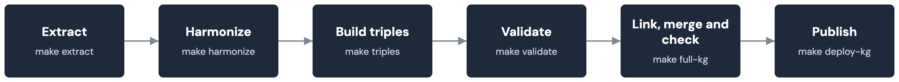

# Build and validation

How the model plus live Synapse data becomes a validated merged graph.
See [Model and identifiers](model.md) and
[Publishing and deposit](publishing.md) for what happens before and
after. The
[kg-pipeline README](https://github.com/mc2-center/data-models/blob/main/kg-pipeline/README.md)
has the full flag reference.

## The stage pipeline

| Stage | Make target | Script | Input | Output |
|---|---|---|---|---|
| 0 | `make mc2-model-linkml` | `scripts/vendor/csv_to_linkml.py` + `scripts/resolve_prefixes.py` | `mc2.model.csv`, `modules/mapping.yaml` | `schema/mc2_model.linkml.yaml` |
| Schema | `make schema` | `linkml generate owl` | Both LinkML schemas | `schema/mc2_model.ttl`, `schema/cckp_portal.ttl` |
| Extract | `make extract` | `scripts/extract_cckp_tables.py` | Synapse: 5 CCKP View tables | `data/raw/*.csv`, `data_sources.yaml` |
| Harmonize | `make harmonize` | `scripts/harmonize.py` | `data/raw/*.csv`, this repo's CVs | `data/harmonized/*_harmonized.csv`, `mappings/sssom/*.sssom.tsv` |
| Triples | `make triples` | `scripts/build_triples.py` | Harmonized CSVs, schema TTLs | `data/rdf/{Class}.ttl`, merged into `cckp_kg.ttl` |
| DataCatalog | `make triples-datacatalog` | `scripts/build_datacatalog_triples.py` | Native Synapse Dataset annotations | `data/rdf/DataCatalog.ttl` |
| SCDM link | `make link-scdm` | `scripts/link_scdm.py` | Reviewed crosswalk rows | `data/rdf/scdm_links.ttl` |
| Crosswalk link | `make link-ontology-crosswalk` | `scripts/link_ontology_crosswalk.py` | Reviewed MONDO/UBERON rows | `data/rdf/ontology_crosswalk_links.ttl` |
| Merge | `make full-kg` | `scripts/merge_ttl.py` | All of the above | `data/rdf/cckp_kg_full.ttl` |
| Manifest | `make manifest` | `scripts/build_manifest.py` | The merged graph, git metadata | `data/rdf/manifest.ttl` |

`make full-kg` rebuilds every input fresh into a separate output file
rather than mutating `cckp_kg.ttl` in place (see "Consuming the graph" in
the kg-pipeline README).

## Harmonization and SSSOM

`make harmonize` resolves every CV-backed portal value against the
vocabulary it maps to, including nonpreferred terms as aliases.

| Report | Meaning |
|---|---|
| `unmapped_terms.csv` | A value that matched nothing — passed through unresolved, never dropped |
| `malformed_cv_terms.csv` | A CV row's own identifier or URL isn't valid — treated as no mapping |
| `mappings/sssom/{enum}.sssom.tsv` | Every value that did resolve, as a reviewable byproduct |

Each pass (portal, DataCatalog, the private assay layer) writes its own
SSSOM files, so none overwrite each other.

A coverage gate compares each field's unmapped-value count against a
committed baseline, failing only if the count grows. `make
update-coverage-baseline` moves it forward after an intentional change.

## Suggest-mappings and crosswalks (human review, never auto-applied)

`make suggest-mappings` turns unresolved values into a reviewable
worklist: a curation gap, a likely typo, or a candidate term from an
external registry. It never edits a CV file directly.

`make crosswalk-ontology`/`make crosswalk-scdm` propose a second kind of
crosswalk, from this pipeline's own CVs to the ontologies sagebrain-model
and SCDM use for the same concepts (details in the kg-pipeline README).

| Crosswalk | Target | Review gate | Status |
|---|---|---|---|
| `consortium_to_scdm_program.tsv` | `sagecdm:Program` | `reviewed` column, default false | All 11 rows reviewed — 11 Program nodes exist |
| MONDO/UBERON tumor-type/tissue crosswalks | `link_ontology_crosswalk.py` | `reviewed` column, default false | Every shipped row still unreviewed — 0 edges minted |
| `institution_to_scdm_organization.tsv` | `sagecdm:Organization` | None — a ROR id is already the institution's identity | Nodes and edges mint on every run |
| `investigatorRef`/`contributorRef` Person stubs | `sagecdm:Person` | None — not gated | Flagged `cckp:provisional true` instead of resolved |

Only a row flipped to `reviewed=true` becomes an edge for the gated
crosswalks, and the gate is preserved across regeneration.

## Validation

`scripts/validate_graph.py` runs independently invokable checks:

| Check | Catches | Severity |
|---|---|---|
| `--parse-only` | RDF syntax errors | Fails the build |
| `--coverage` | The ratchet described above | Fails the build |
| `--shacl` structural shapes (`sh:class` join targets, external-IRI patterns) | A join landing on the wrong class, a malformed DOI/PubMed IRI | Fails the build |
| `--shacl` literal data-quality shapes | A row's own field not fitting its expected shape | Printed only |
| `--queries` sanity checks (`queries/*.rq`) | Core classes present, dual-typing consistency, merged-node conflicts | Fails the build if not met |

SHACL validation runs without RDFS/OWL entailment, matching
sagebrain-model's own configuration — inference would make a class
membership check vacuous by entailing the very type it's checking for.

All 6 `queries/*.rq` checks currently pass; `queries/examples/*.rq` is a
separate, non-pass/fail cookbook — see [Querying the graph](querying.md).

## Tests

`kg-pipeline/test/` is a pytest suite (`make test`) on small, hand-made
fixtures — no live Synapse access needed.
