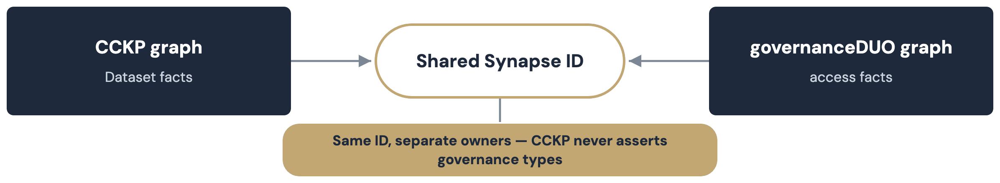

# Federation and sagebrain-model

kg-pipeline federates with two different sibling repositories, for two
different reasons. See [Build and validation](build.md) for how the SCDM
and ontology-crosswalk layers below actually get built.

| Partner | Kind | What kg-pipeline links to it | Gate |
|---|---|---|---|
| Sage Common Data Model (SCDM) | Sibling schema, cross-portal Organization/Program/Person | `institutionRef`/`consortiumRef`/`investigatorRef`/`contributorRef` edges | Program edges: reviewed. Organization edges and Person stubs: not gated (see note below) |
| MONDO/UBERON crosswalks | Ontology-anchoring for sagebrain-model | Ontology-crosswalk federation edges | Human-reviewed; every shipped row is currently unreviewed |
| sagebrain-model | Sibling domain ontology | The private assay-metadata layer only — see below | `confidence: high` rows only (automatic, not reviewed) |
| governanceDUO | Sibling access-control graph | Nothing asserted directly — see "The D9 join" below | N/A — the join is structural, not a mapping |

A Program edge requires a human-reviewed crosswalk row; an Organization
edge mints automatically from a stable registry id; a Person edge is
flagged `cckp:provisional true` instead.

## SCDM and the ontology crosswalks

kg-pipeline's own 5 portal classes have no direct entity overlap with
sagebrain-model — that overlap is one layer down, handled by the private
assay-metadata layer described next.

## The private assay-metadata layer

A separate pipeline stage extracts access-controlled per-file annotations
and links them into sagebrain-model's own classes, reusing its declared
vocabulary rather than inventing new predicates. It applies the
MONDO/UBERON crosswalks automatically wherever a row's `confidence` is
`high` (an exact label match) — no human review, unlike the Program and
public ontology-crosswalk links above — and publishes only to a private
staging folder (see [Publishing and deposit](publishing.md)).

## The D9 join with governanceDUO

governanceDUO is a sibling *access-control* graph — who may access what,
under which conditions. It owns the `gov:` namespace and its own closed
`gov:SynapseEntity` shape, which requires Synapse ACL metadata this
pipeline doesn't have.

kg-pipeline **deliberately does not assert `gov:SynapseEntity`**, even
though both graphs land in the same Neptune store: doing so would fail
governanceDUO's closed shape and duplicate a fact it already owns (see
[the D9 alignment plan](https://github.com/mc2-center/data-models/blob/main/plans/kg_pipeline_sagebrain_alignment.md)).
The join works anyway — this pipeline's canonical Synapse IRI is the same
base governanceDUO and sagebrain-model use, so a shared id needs no
shared type.

## Where to look next

| For | See |
|---|---|
| The SCDM federation design | [scdm_alignment.md](https://github.com/mc2-center/data-models/blob/main/plans/scdm_alignment.md) |
| The MONDO/UBERON crosswalk-promotion design | [mondo_uberon_federation_promotion.md](https://github.com/mc2-center/data-models/blob/main/plans/mondo_uberon_federation_promotion.md) |
| Why kg-pipeline doesn't assert `gov:SynapseEntity` | [kg_pipeline_sagebrain_alignment.md](https://github.com/mc2-center/data-models/blob/main/plans/kg_pipeline_sagebrain_alignment.md) |
