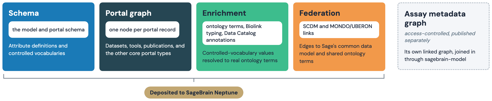
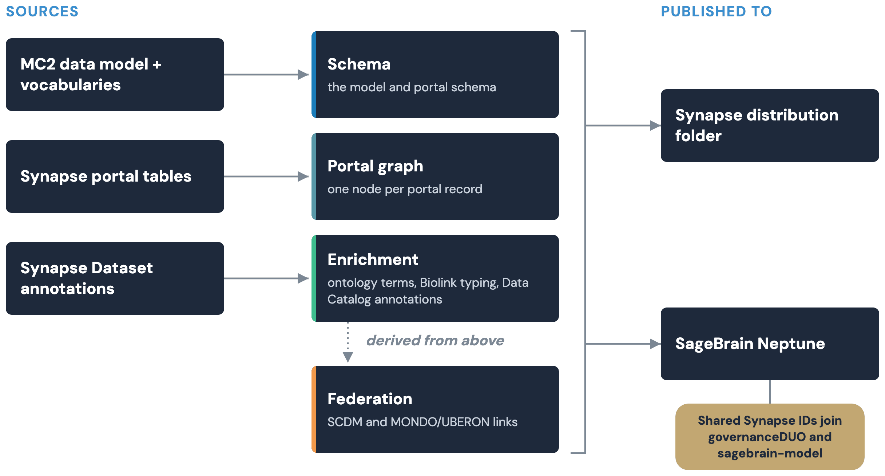

# Knowledge graph: Overview

The Cancer Complexity Knowledge Portal lists datasets, publications, tools,
grants and educational resources as five separate tables. Answering a
question that spans more than one of them — which tools were used on
datasets about a given disease, what a consortium's funding produced —
normally means joining those tables by hand. This pipeline builds the same
information into one graph instead, so a single query can answer it.

This page is the plain-language overview. The other pages under Knowledge
Graph in the navigation cover the technical depth, and the kg-pipeline
README has the full command reference.

## 1. What the graph is for

The graph resolves each portal value to a real scientific term where one
exists, and links related records together — a dataset to its funding
grant, a publication to the dataset it describes. It never guesses: a value
with no match stays as plain text.

Most links come straight from matching values. Its Program and
disease/tissue crosswalks into the public graph wait for a person to
approve them; the private file-level layer links to sagebrain-model
automatically instead, on an exact label match only.

What it deliberately doesn't do:

| It doesn't | Because |
|---|---|
| Force a match for every value | An unmatched value stays as plain text, not a guess |
| Apply a public-graph crosswalk on its own | Program and disease/tissue rows wait for approval (see Federation) |
| Assert the access-control graph's own facts | That graph owns those facts; this one only shares an identifier with it |
| Extract the portal's own Person table | Not pulled in yet; investigators and contributors become provisional stubs instead |
| Mix in the private, file-level layer | It's built and published separately |

## 2. Where it sits

| Part | Role |
|---|---|
| Synapse | The source: portal tables, dataset annotations, and separately, file-level annotations |
| This repo's model | Supplies the vocabulary the graph resolves values against |
| The pipeline | Builds, checks and publishes the graph — see Build and validation |
| The published graph | Available from Synapse, and from Sage Bionetworks' shared graph store |
| Federation targets | Links to the Sage Common Data Model and to ontology crosswalks — see Federation |
| The private layer | A separate, access-controlled graph of file-level facts |
| The access-control graph | A sibling system that shares only an identifier with this one |

## 3. The layers

The graph is built in layers: a schema, one record per portal row,
enrichment that adds real terms and a second type, and federation links
to sibling systems. A separate, private layer covers file-level facts.
Details are in Model and identifiers and Build and validation.

## 4. Last verified build (2026-09-29)

| | |
|---|---|
| Rows extracted | 1141 datasets, 4773 publications, 349 tools (331 nodes), 160 grants, 10 resources, 966 catalog rows |
| Graph size | 304,989 triples in the public portal graph; 337,917 once federation is added |
| Deposited to the shared graph store | 360,370 distinct triples |

| Part | Status |
|---|---|
| Portal graph, validation and query checks | Operational; all checks pass on the live build |
| Organization links to the Sage Common Data Model | Operational; minted automatically from each institution's registry id |
| Program links | Operational; all 11 consortium rows are approved |
| Disease/tissue crosswalks, public graph | Built and tested; no rows approved yet, so no links |
| Disease/tissue crosswalks, private layer | Operational; applies automatically on an exact label match |
| Private file-level layer | Implemented; published only to an access-restricted location |
| Deposit to the shared graph store | Operational; latest deposit 2026-09-29 |

## Where to look next

| For | See |
|---|---|
| Schemas, identifiers, and a worked example | [Model and identifiers](model.md) |
| The build pipeline and validation | [Build and validation](build.md) |
| Publishing and the deposit guards | [Publishing and deposit](publishing.md) |
| A query cookbook | [Querying the graph](querying.md) |
| Federation with sibling systems | [Federation and sagebrain-model](federation.md) |
| The full command reference | [the kg-pipeline README](https://github.com/mc2-center/data-models/blob/main/kg-pipeline/README.md) |
| Design rationale and scope limits | [the architecture decisions plan](https://github.com/mc2-center/data-models/blob/main/plans/kg_pipeline_architecture_decisions.md) |
| The data model itself | [Home](../index.md) and the Data Models section |
