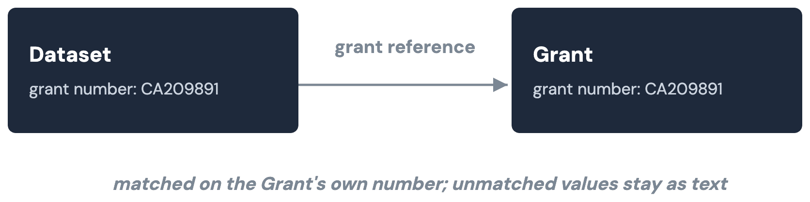
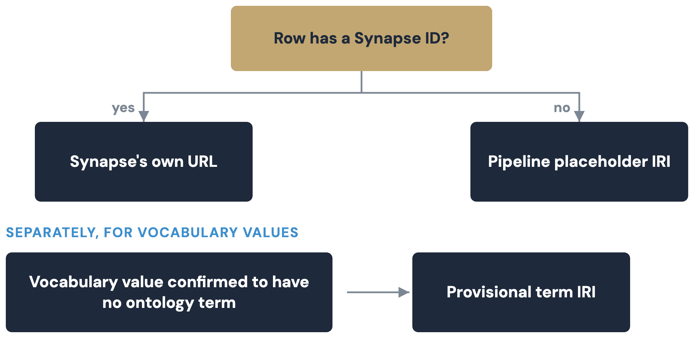

# Model and identifiers

This page covers the LinkML schemas, class alignment, the "Key"-to-"Ref"
join convention, and how every IRI is minted. See
[Overview](index.md) for context, and the
[kg-pipeline README](https://github.com/mc2-center/data-models/blob/main/kg-pipeline/README.md)
for scripts and flags this page doesn't repeat.

## LinkML schemas

| Schema | Source | Notes |
|---|---|---|
| `schema/mc2_model.linkml.yaml` | This repo's `mc2.model.csv` + `modules/mapping.yaml` | Generated by a vendored converter (Stage 0 in [Build and validation](build.md)) |
| `schema/cckp_portal.linkml.yaml` | Hand-authored | Imports `mc2_model.linkml`'s shared enums; its 5 classes match the live Synapse table shapes |

## Class alignment (schema.org / Biolink)

`cckp_portal.linkml.yaml` declares a schema.org and Biolink mapping per
class (see the
[class-alignment design](https://github.com/mc2-center/data-models/blob/main/plans/cckp_schema_class_alignment.md)).

| Class | schema.org | Biolink |
|---|---|---|
| Dataset | `schema:Dataset` (exact) | `biolink:Dataset` (exact) |
| Publication | `schema:ScholarlyArticle` (exact) | `biolink:Publication` (exact) |
| Tool | `schema:SoftwareApplication` (exact) | `biolink:InformationContentEntity` (close) |
| Grant | `schema:MonetaryGrant` (exact) | `biolink:AdministrativeEntity` (close) |
| EducationalResource | `schema:LearningResource` (close) | `biolink:InformationContentEntity` (close) |

Biolink is materialized as a second `rdf:type` on every instance and
checked on every build; the schema.org alignment stays a class-level
claim only (real `schema:` predicates come from the DataCatalog layer).

## Foreign keys: "Key" in the model, "Ref" in the graph

Every foreign-key attribute in the model is named `"<Entity> Key"`
(`Dataset Key`, `Grant Key`, ...), defined once in
`modules/shared/annotationProperty.csv`; a Key value is a plain string
naming another record, not an embedded object. `Ref` edges are a separate
thing: `cckp_portal.linkml.yaml` marks specific portal-schema columns —
never a model "Key" field — with a `cckp_join` annotation, and
`build_triples.py` resolves those into a `Ref` edge. `mc2_model.linkml.yaml`
carries no `cckp_join` at all, so a model "Key" field (like `File View`'s
`Biospecimen Key`) stays a plain literal unless a separate stage resolves
it, as `link_sagebrain.py` does by grouping rows on the literal value.

| Portal column | Joins to | Ref edge |
|---|---|---|
| `grantNumber` | `Grant.grantNumber` | `cckp:grantNumberRef` |
| `pubMedId` | `Publication.pubMedId` | `cckp:pubMedIdRef` |
| `dataset`/`datasets` | `Dataset.datasetAlias` | `cckp:datasetRef` |



## Identifiers and namespaces

One function mints every instance IRI, so every script that points at an
existing row does it the same way.



A row with a real Synapse id gets Synapse's own canonical IRI — the same
base governanceDUO and sagebrain-model use, so the graphs join with no
translation. A row with no Synapse id gets a placeholder IRI this
pipeline owns.

Dataset and Grant use a declared identifier slot (`datasetId`, `grantId`);
the other three classes fall back through a per-class field, and finally
to a synthetic id, `"synthetic-" + sha1(...)[:16]`, hashed from whatever
fallback fields are populated:

| Class | Falls back to | Last resort, hashed |
|---|---|---|
| Publication | `pubMedId` | `publicationTitle` + `doi` |
| Tool | `toolName` | `description` + `downloadUrl` |
| EducationalResource | `internalIdentifier`/`alias` | `title` |

A CV value confirmed to have no real ontology term instead gets a
provisional IRI, `.../cckp-portal/terms/{field}/{slug}`, rather than a
dead-end literal or a guess.

| Namespace | Base IRI | Used for |
|---|---|---|
| `cckp:` | `https://w3id.org/mc2-center/cckp-portal/` | Every class/predicate this pipeline mints |
| (no prefix) | `https://w3id.org/mc2-center/cckp-portal/data/` | Locally-minted instance IRIs |
| (no prefix) | `https://w3id.org/mc2-center/cckp-portal/terms/` | Provisional placeholder concepts |
| (no prefix) | `https://www.synapse.org/Synapse:` | Canonical Synapse-entity IRIs |
| `mc2:` | `https://w3id.org/mc2-center/mc2-model/` | MC2 model schema terms |
| `biolink:` | `https://w3id.org/biolink/vocab/` | Dual typing, private-layer stub nodes |
| `schema:` | `https://schema.org/` | Class alignment, real DataCatalog predicates |
| `sagecdm:` | `https://sage-bionetworks.github.io/SageCommonDataModel/` | SCDM federation nodes |
| `sagebrain:` | `https://w3id.org/synapse/sagebrain#` | Private-layer links into sagebrain-model |
| (ontology bases) | NCIT/EDAM/ROR/SNOMED/... | Resolved ontology and registry terms |
| `shape:` | `https://w3id.org/mc2-center/cckp-portal/shapes#` | SHACL shape names |
| `gov:` | `https://w3id.org/synapse/governance#` | governanceDUO's own namespace — never asserted here |

See [Federation and sagebrain-model](federation.md) for why kg-pipeline
never mints or asserts anything in `gov:`.

## A worked example

Real, trimmed output for one Dataset row, `syn20826574`
(`kg-pipeline/data/rdf/Dataset.ttl`, from a live build):

```turtle
@prefix cckp: <https://w3id.org/mc2-center/cckp-portal/> .
@prefix biolink: <https://w3id.org/biolink/vocab/> .

<https://www.synapse.org/Synapse:syn20826574> a biolink:Dataset,
        cckp:Dataset ;
    cckp:assay "CRISPR" ;
    cckp:consortium "CSBC" ;
    cckp:datasetAlias "Genetic Interactions of Chromatin-Related Genes" ;
    cckp:datasetId "syn20826574" ;
    cckp:doi "https://doi.org/10.1038/nmeth.4286" ;
    cckp:doiIri <https://doi.org/10.1038/nmeth.4286> ;
    cckp:fileFormats "Pending Annotation" ;
    cckp:fileFormatsTerm <http://purl.obolibrary.org/obo/NCIT_C53470> ;
    cckp:grantNumber "CA209891" ;
    cckp:grantNumberRef <https://www.synapse.org/Synapse:syn10140998> ;
    cckp:pubMedId "28481362" ;
    cckp:pubMedIdIri <https://pubmed.ncbi.nlm.nih.gov/28481362> ;
    cckp:pubMedIdRef <https://w3id.org/mc2-center/cckp-portal/data/Publication/28481362> ;
    cckp:species "Human" ;
    cckp:speciesTerm <http://purl.obolibrary.org/obo/NCIT_C14225> ;
    cckp:tumorType "Not Applicable" ;
    cckp:tumorTypeTerm <http://purl.obolibrary.org/obo/NCIT_C48660> ;
    cckp:version 1 .
```

The subject is the dataset's own Synapse IRI, not a second identifier.
`doi`/`pubMedId` are raw portal values; `doiIri`/`pubMedIdIri` are
resolvable IRIs templated from their shape.

`tumorTypeTerm`/`speciesTerm`/`fileFormatsTerm` are the real NCIT concept
each value resolved to. `grantNumberRef`/`pubMedIdRef` are the two
resolved joins, one Synapse-canonical and one locally minted.
