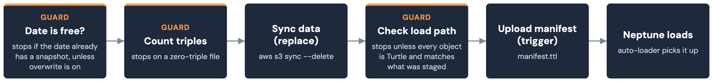

# Publishing and deposit

Where a built graph goes once [Build and validation](build.md) has
produced and validated it, and what the manifest published alongside it
records.

## Publish paths

| Make target | Destination | Contents |
|---|---|---|
| `make publish-portal-kg` | Public Synapse staging folder (`syn76958235`) | `data/{raw,harmonized,rdf}/` only — never `data/mc2_assay/`; new versions each run |
| `make deploy-kg` | Synapse distribution folder (`syn77443315`) | Just `cckp_kg_full.ttl` + `manifest.ttl` — the path other systems pull from |
| `make upload-sagebrain-s3` | SageBrain Neptune S3 bucket, date-partitioned | `schema/*.ttl` + `cckp_kg_full.ttl` + `manifest.ttl` |
| `make publish-mc2-assay` | Access-controlled staging folder (`syn76957723`) | The private assay-metadata tree |

`make upload-sagebrain-s3` has no CI — it runs with whatever AWS
credentials the shell already has. `--dry-run` mirrors the same layout
locally, with no bucket or credentials needed. `make publish-mc2-assay`
refuses to upload if the target's effective ACL grants PUBLIC or
AUTHENTICATED_USERS read/download access.

## The manifest

`scripts/build_manifest.py` emits `manifest.ttl`: a small PROV/VOID
statement about one build, shaped to match nf-osi/kg-pipeline's own
manifest convention so the same downstream Neptune loader works for
either pipeline.

| Field | Meaning | Present in |
|---|---|---|
| `prov:Activity`/`void:Dataset` subject | One node per build, keyed by git commit | Every manifest |
| `prov:generatedAtTime` | When the build ran | Every manifest |
| `prov:used` | The source commit | Every manifest |
| `cckp:portal`, `cckp:gitCommit`, `cckp:gitRef` | Build metadata | Every manifest |
| `void:dataDump` | Where this build was actually published | Every manifest |
| `void:triples` | Distinct triple count across the deposited files | SageBrain deposit only |
| `cckp:snapshotDate` | The date partition this snapshot landed in | SageBrain deposit only |
| `cckp:depositedAtTime` | When the deposit ran | SageBrain deposit only |

Some of nf-osi/kg-pipeline's manifest fields (a CI run id, who triggered
it) are deliberately absent: this pipeline's deposit is a local script
run, not a CI job, so there's no such run to name — and inventing one
would be a false provenance claim.

## Deposit guards

The script runs three checks, in order, before anything reaches Neptune:
a date check, a triple count, and a load-path check after the sync.

| Guard | Checks | Bypass |
|---|---|---|
| Date must be free | The date partition isn't already used | `--allow-overwrite` |
| No empty files | Every file about to deposit parses to at least one triple | None |
| Load path is clean | Every uploaded key ends `.ttl`, and the exact key set matches what was staged | None |

Between the triple count and the load-path check, a single `sync --delete`
replaces the whole prefix, so a second deposit on the same date fully
replaces the first. `manifest.ttl` — the trigger sentinel — uploads last,
only once the load-path check passes.
